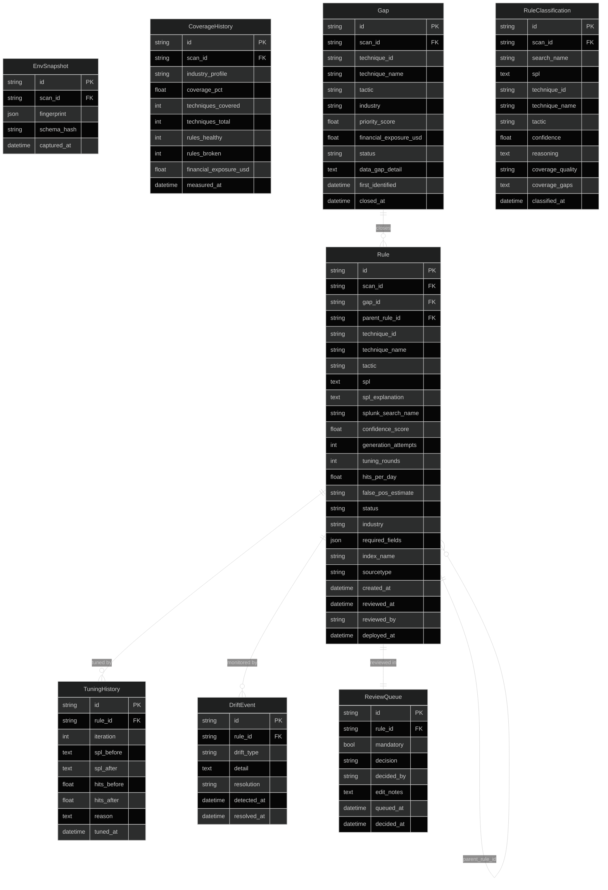
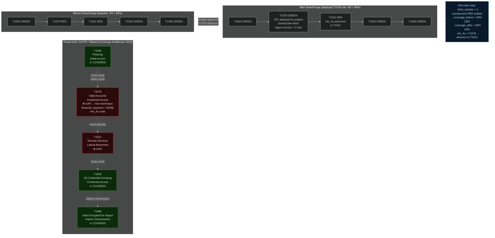

```mermaid
%%{init: {"theme": "dark", "themeVariables": {"primaryColor":"#1a1a2e","edgeLabelBackground":"#16213e"}}}%%
flowchart TB

    classDef user     fill:#0d1b2a,stroke:#4fc3f7,color:#e1f5fe
    classDef ui       fill:#0a200a,stroke:#66bb6a,color:#e8f5e9
    classDef api      fill:#1f1f00,stroke:#ffd54f,color:#fff9c4
    classDef agent    fill:#1f0e00,stroke:#ffa726,color:#fff3e0
    classDef llm      fill:#1a0a2a,stroke:#ce93d8,color:#f3e5f5
    classDef splunk   fill:#2a0808,stroke:#ef9a9a,color:#ffebee
    classDef intel    fill:#00101f,stroke:#4fc3f7,color:#e1f5fe
    classDef data     fill:#080820,stroke:#7986cb,color:#e8eaf6
    classDef sched    fill:#101010,stroke:#a5a5a5,color:#f5f5f5

    %% ─── USERS ───────────────────────────────────────────────────────────────
    SOC(["👤 SOC Analyst"]):::user
    ADM(["🔧 Admin"]):::user

    %% ─── FRONTEND ────────────────────────────────────────────────────────────
    subgraph FE ["Frontend Layer"]
        PANEL["🖥 HITL Control Panel
        api/static/control.html  ·  GET /
        ─────────────────────────────
        • Polls /review/queue every 3 s
        • Detection cards: technique · SPL
          confidence · hits/day · FP risk
        • Approve / Reject / Edit inline
        • Run Scan + Trigger Drift buttons
        • Live coverage % + deployed count"]:::ui

        subgraph SPLKDASH ["Splunk Dashboard Studio  (4 dashboards — CSV-backed)"]
            direction LR
            D1["coverage_heatmap
            ATT&CK overlay
            coverage % per technique"]:::ui
            D2["financial_risk
            FAIR model bars
            gap exposure in $USD"]:::ui
            D3["rule_health
            deployed count
            BROKEN alerts"]:::ui
            D4["drift_timeline
            SCHEMA_DRIFT events
            agent activity stream"]:::ui
        end
    end

    %% ─── REST API ────────────────────────────────────────────────────────────
    subgraph RESTAPI ["FastAPI  ·  uvicorn  ·  :8077"]
        direction LR
        A1["POST /api/v1/scan
        → triggers async pipeline"]:::api
        A2["GET /scan/{id}/status"]:::api
        A3["GET /rules  /rules/{id}"]:::api
        A4["GET /coverage  /coverage/history"]:::api
        A5["GET /review/queue
        POST /review/{id}/approve
        POST /review/{id}/reject
        POST /review/{id}/edit"]:::api
        A6["GET /gaps  /gaps/financial"]:::api
        A7["POST /ask  (SSE streaming)
        Claude claude-sonnet-4-6 NL interface"]:::api
        A8["GET /attack-path
        actor kill-chain JSON"]:::api
    end

    %% ─── LANGGRAPH PIPELINE ──────────────────────────────────────────────────
    subgraph AG ["LangGraph StateGraph  ·  DetectForgeOrchestrator"]

        subgraph PH1 ["① Env Scanner  ·  env_scanner.py"]
            N1["MCP: splunk_get_knowledge_objects  row_limit=1000
            MCP: run_query fieldsummary per sourcetype
            Tags security_relevant sourcetypes
            Queries real EventCodes from live BOTS v3
            ─────────────────────────────────────────
            → env_fingerprint { indexes { sourcetypes { fields, eventcodes } } }
            → EnvSnapshot (fingerprint JSON, schema_hash)"]:::agent
        end

        subgraph PH2 ["② Coverage Analysis"]
            N2A["Rule Classifier  ·  rule_classifier.py
            Parses ATT&CK header annotation → conf 1.0
              SPL comment: ATTACK_TECHNIQUE=Txxxx ATTACK_TACTIC=...
            Llama-3.3-70B fallback for unannotated rules
            Filters: skip splunk_instrumentation / health / audit apps
            ─────────────────────────────────────────
            → coverage_map { technique_id → classification }
            → RuleClassification (technique_id, confidence, coverage_quality)"]:::agent

            N2B["Gap Prioritizer  ·  gap_prioritizer.py
            MITRE ATT&CK: 697 enterprise techniques · 14 tactics
            FAIR financial model:
              ALE = ARO × (asset_value × ef × sector_weight)
              priority_score = 0.4×prevalence + 0.3×FAIR
                             + 0.2×data_available + 0.1×recency
            Labels: CLOSABLE / DATA_PARTIAL / DATA_GAP
            ─────────────────────────────────────────
            → all_gaps[], prioritized_gaps[] (max 20 per scan)
            → Gap (technique_id, tactic, priority_score, financial_exposure_usd)"]:::agent
        end

        subgraph PH3 ["③ SPL Generator  ·  spl_generator.py  (per-gap loop)"]
            N3["_pick_primary_sourcetype() — tactic→sourcetype map:
              Credential Access / Privilege Escalation → WinEventLog:Security
              C2 / Exfiltration → stream:dns · stream:http · stream:ip
              Cloud (T1078.004) → aws:cloudtrail · aws:cloudwatchlogs
            _top_eventcodes() — live query: top 12 EventCodes from
              correct sourcetype in BOTS v3 (prevents invented codes)
            Llama-3.3-70B prompt: 1 sourcetype · 1 EventCode
              no rare literals · no agg funcs in where clause
            Curated library for T1078 (bypasses LLM, conf=0.9)
            ─────────────────────────────────────────
            → Rule (status=PENDING_REVIEW, confidence_score)"]:::agent

            N3R["Foundation-sec Review Loop  ·  foundation_sec.py
            Foundation-sec-1.1-8b via Together AI
            Approves syntactically valid SPL
            Non-blocking: enhancements are suggestions only
            Up to max_spl_generation_attempts retries
            Seed template fallback → conf 0.55 (manual review)"]:::llm
        end

        subgraph PH4 ["④ Validator  ·  validator.py"]
            N4["MCP: run_search against live BOTS v3
            Calculates hits_per_day from result_count
            Status:
              GOOD        0 < hits ≤ 100/day   FP=LOW
              NOISY       100–1 000/day
              VERY_NOISY  > 1 000/day
              DATA_ABSENT sourcetype has 0 events
              QUERY_ERROR sourcetype exists but 0 hits
            FP estimate: LOW (EventCode match) / MEDIUM / HIGH
            ─────────────────────────────────────────
            → Rule.hits_per_day · Rule.false_pos_estimate"]:::agent

            N4SC["Self-Correction Loop  (QUERY_ERROR only)
            validation_feedback injected into next generation:
              'Broaden: use EventCode that exists in env,
              drop rare literals, lower thresholds,
              never call count() inside where'
            → re-run Phase 3 once → re-validate
            If still fails: mandatory_review=True, queued anyway
            HITL never drops a detection"]:::agent
        end

        subgraph PH5 ["⑤ Auto-Tuner + Human Review Queue"]
            N5A["Auto-Tuner  ·  auto_tuner.py  (NOISY / VERY_NOISY)
            saia_optimize_spl up to 3 rounds (pending config)
            Fallback: Llama broadening prompt via mcp_client
            Records each iteration:
              TuningHistory (spl_before, spl_after,
              hits_before, hits_after, reason)
            ─────────────────────────────────────────
            → Rule.tuning_rounds updated"]:::agent

            N5B["Human Review Queue  ·  queue_manager.py
            mandatory=True when:
              confidence < 0.7  OR
              status ∈ { QUERY_ERROR, DATA_ABSENT }
            Analyst actions via HITL Control Panel:
              APPROVE → triggers deployer
              REJECT  → Rule.status=RETIRED
              EDIT    → update SPL inline, then re-validate
            ─────────────────────────────────────────
            → ReviewQueue (decision, decided_by, edit_notes)"]:::agent
        end

        subgraph PH6 ["⑥ Deployer  +  Drift Monitor"]
            N6A["Deployer  ·  deployer.py
            Splunk REST PUT /savedsearches/{name}
            Idempotent: 409 Conflict → UPDATE (not fail)
            Re-scores ALPHV kill-chain after each deploy:
              T1078 approved → attack-path node RED→GREEN
              blind_window decrements, min_fix advances
            ─────────────────────────────────────────
            → Rule.status = DEPLOYED
            → CoverageHistory (coverage_pct,
              techniques_covered/total, financial_exposure_usd)"]:::agent

            N6B["Drift Monitor  ·  drift_monitor.py  (APScheduler 6 h)
            SCHEMA_DRIFT  field-existence check (earliest=0)
              reads results[0]['count'] VALUE — not stats object
            SILENT        0 hits N consecutive days [disabled demo]
            DATA_STALE    freshness check [disabled demo]
            Config flags:
              drift_silent_check_enabled=false
              drift_freshness_check_enabled=false
            ─────────────────────────────────────────
            → Rule.status = BROKEN
            → DriftEvent (drift_type, detail, resolution)"]:::agent
        end
    end

    %% ─── LLM LAYER ───────────────────────────────────────────────────────────
    subgraph LLM ["✦ AI / LLM Layer"]
        direction LR
        LLAMA["Together AI
        Llama-3.3-70B-Instruct-Turbo
        OpenAI-compatible SDK
        base_url: api.together.xyz/v1
        max_tokens=800  temp=0.1
        ─────────────────
        Phases 2+3: classify + generate SPL
        ~2 s response · clean content return"]:::llm

        FSEC["Foundation-sec-1.1-8b
        via Together AI
        ─────────────────
        Phase 3: SPL review gate
        approves / suggests improvements"]:::llm

        CLDAI["Anthropic Claude claude-sonnet-4-6
        ─────────────────
        POST /api/v1/ask  (SSE streaming)
        coverage_responder.py
        Natural language SIEM Q&A"]:::llm

        SAIA["Splunk Hosted Models  ⚠ config pending
        saia_generate_spl
        saia_optimize_spl
        saia_explain_spl
        saia_ask_splunk_question
        ─────────────────
        Error: configs ref before assignment
        Prize target: Best Use of Splunk Hosted Models"]:::llm
    end

    %% ─── SPLUNK PLATFORM ─────────────────────────────────────────────────────
    subgraph SP ["Splunk Enterprise 10.4"]
        direction TB
        subgraph SPLAPIS ["Splunk APIs"]
            direction LR
            MCP["MCP Server
            :8000/en-US/splunkd/__raw/services/mcp
            JSON-RPC 2.0 over HTTP · 14 tools
            ─────────────────
            splunk_run_query
            splunk_get_indexes
            splunk_get_knowledge_objects
            splunk_get_field_summary
            splunk_get_info
            saia_generate_spl  ⚠
            saia_optimize_spl  ⚠
            saia_explain_spl   ⚠
            saia_ask_splunk_question  ⚠"]:::splunk

            RAPI["REST API  :8089 HTTPS
            Basic auth: ankur/ankur10@
            ─────────────────
            PUT /savedsearches/{name}
            GET /savedsearches
            POST /search/jobs"]:::splunk

            HEC["HEC
            → detectforge_activity index
            ─────────────────
            Agent action event stream:
            scan_id · phase · technique_id
            confidence · severity · detail"]:::splunk
        end

        subgraph SPIDX ["Splunk Indexes"]
            direction LR
            BOTS["botsv3  ·  BOTS v3 Dataset
            WinEventLog:Security  46k events
            Real EventCodes: 4624 4673 4688 5156 4104
            ─────────────────
            syslog · stream:ip · osquery:results
            stream:dns · WinHostMon
            aws:cloudwatchlogs · cisco:asa
            WinEventLog:Security"]:::splunk

            BASE["search app  (seed baseline)
            16 ATT&CK-annotated saved searches
            tag: security_baseline
            SPL header: ATTACK_TECHNIQUE=Txxxx
            ─────────────────
            Deliberate gap: T1078 + T1021
            (demo: RED nodes in kill-chain)"]:::splunk

            ACT["detectforge_activity
            HEC-ingested agent action log
            live agentic ops stream"]:::splunk
        end
    end

    %% ─── INTELLIGENCE LAYER ──────────────────────────────────────────────────
    subgraph INT ["⚑ Threat Intelligence Layer"]
        direction LR
        ATK["MITRE ATT&CK
        enterprise-attack.json
        697 enterprise techniques
        14 tactics
        attack_loader.py"]:::intel

        KCM["Kill-Chain Mapper
        kill_chain_mapper.py
        networkx DiGraph
        ALPHV / BlackCat actor chain:
        T1566→T1078→T1021→T1003→T1486
        blind_window=2  min_fix=T1078
        Coverage: 60%→80% after T1078 deploy"]:::intel

        KEV["CISA KEV API
        known-exploited-vulnerabilities.json
        Daily sync  (APScheduler)
        threat_intel.py"]:::intel
    end

    %% ─── DATA LAYER ──────────────────────────────────────────────────────────
    subgraph DL ["⊞ Data Persistence Layer"]
        direction LR
        SQDB["SQLite  ·  SQLAlchemy ORM  ·  detectforge.db
        ─────────────────────────────────
        env_snapshots      coverage_history
        gaps               rules
        tuning_history     drift_events
        review_queue       rule_classifications"]:::data

        CSVL["Splunk CSV Lookups  (dashboard bridge)
        makeresults format=csv | outputlookup
        ─────────────────────────────────
        detectforge_coverage.csv
        detectforge_gaps.csv
        detectforge_rules.csv
        detectforge_drift_count.csv"]:::data
    end

    %% ─── SCHEDULER ───────────────────────────────────────────────────────────
    SCHED["APScheduler
    drift_monitor   every 6 h
    CISA KEV sync   daily"]:::sched

    %% ─── CONNECTIONS ─────────────────────────────────────────────────────────
    SOC -->|browser| PANEL
    SOC -->|Splunk Web :8000| SPLKDASH
    ADM --> A1

    PANEL -->|3 s poll| A5
    PANEL -->|POST /scan| A1
    PANEL -->|approve action| A5

    A1 -->|async run| N1
    A5 -->|APPROVED| N6A
    A7 --> CLDAI
    A8 --> KCM

    N1 --> N2A
    N2A --> N2B
    N2B --> N3
    N3 --> N3R
    N3R -->|approved| N4
    N4 -->|QUERY_ERROR| N4SC
    N4SC -->|regenerate| N3
    N4 -->|NOISY / VERY_NOISY| N5A
    N5A --> N5B
    N4 -->|GOOD / DATA_ABSENT| N5B
    N5B -->|APPROVED| N6A
    N6A -.->|monitors| N6B

    N1 -->|discover + fingerprint| MCP
    N2A -->|classify fallback| LLAMA
    N2A -->|discover_knowledge_objects| MCP
    N3 -->|generate SPL| LLAMA
    N3 -->|saia_generate_spl ⚠| MCP
    N3R -->|review| FSEC
    N4 -->|run_search| MCP
    N5A -->|saia_optimize_spl ⚠| MCP
    N6A -->|PUT /savedsearches| RAPI
    N6B -->|field-existence check| MCP
    N1 -->|HEC events| HEC
    N3 -->|HEC events| HEC
    N4 -->|HEC events| HEC

    MCP -.->|query| BOTS
    MCP -.->|query| BASE
    RAPI -.->|deploy to| BASE
    HEC -.->|write| ACT

    ATK --> N2A
    ATK --> N2B
    KCM --> A8
    KEV --> N2B

    SCHED --> N6B
    SCHED --> KEV

    N1 -->|ORM write| SQDB
    N2A -->|ORM write| SQDB
    N2B -->|ORM write| SQDB
    N3 -->|ORM write| SQDB
    N4 -->|ORM write| SQDB
    N5A -->|ORM write| SQDB
    N5B -->|ORM write| SQDB
    N6A -->|ORM write| SQDB
    N6B -->|ORM write| SQDB
    N6A -->|push_scan_results_to_csv| CSVL
    CSVL -->|inputlookup| SPLKDASH
```

# DetectForge — Technical Architecture

> **Splunk Agentic Ops Hackathon 2026 · Security Track**
>
> Autonomous detection engineering platform that reads live Splunk telemetry,
> maps MITRE ATT&CK coverage gaps, generates environment-aware SPL, validates
> against real data, routes through human review, deploys, and continuously
> monitors for schema drift — all orchestrated by a LangGraph StateGraph agent.

---

## 1. System Architecture Overview

---

---

## 2. Agent Pipeline — Detailed Flow

```mermaid
%%{init: {"theme": "dark"}}%%
flowchart TD

    classDef phase  fill:#1f1000,stroke:#ffa726,color:#fff3e0
    classDef llm    fill:#1a0a2a,stroke:#ce93d8,color:#f3e5f5
    classDef decide fill:#001020,stroke:#4fc3f7,color:#e1f5fe
    classDef store  fill:#080820,stroke:#7986cb,color:#e8eaf6
    classDef ext    fill:#002010,stroke:#66bb6a,color:#e8f5e9

    START(["POST /api/v1/scan\nscan_id = uuid4()\nindustry = env or param"])

    P1["① ENV SCANNER
    MCP: splunk_get_knowledge_objects  row_limit=1000
    MCP: run_query fieldsummary per sourcetype
    Queries top 12 real EventCodes per sourcetype
    ─────────────────────────────────────────────
    Writes → EnvSnapshot"]:::phase

    P2A["② RULE CLASSIFIER
    Parses SPL header annotations at conf=1.0
      ATTACK_TECHNIQUE=Txxxx  ATTACK_TACTIC=...
    Llama-3.3-70B fallback for unannotated rules
    Filters out ops/health/instrumentation apps
    ─────────────────────────────────────────────
    Writes → RuleClassification × N
    Builds → coverage_map { technique_id: classification }"]:::phase

    P2B["② GAP PRIORITIZER
    All 697 ATT&CK techniques vs coverage_map
    FAIR: ALE = ARO × (asset_value × ef × sector_weight)
    priority = 0.4×prevalence + 0.3×FAIR + 0.2×data + 0.1×recency
    ─────────────────────────────────────────────
    Writes → Gap × N  (CLOSABLE / DATA_PARTIAL / DATA_GAP)
    coverage_before_pct  ·  total_financial_exposure_usd"]:::phase

    GAPLOOP{{"For each gap in\nprioritized_gaps[:20]"}}:::decide

    P3["③ SPL GENERATOR
    _pick_primary_sourcetype() — tactic→sourcetype map
    _top_eventcodes() — live BOTS v3 query (prevents invented codes)
    Curated library check (T1078 → conf=0.9, bypass review)
    Llama-3.3-70B prompt:
      1 sourcetype · 1 EventCode · no rare literals
      no agg funcs in where · end with eval rule_name=...
    ─────────────────────────────────────────────
    Writes → Rule (status=PENDING_REVIEW)"]:::phase

    FSECREV{"Foundation-sec-1.1-8b
    SPL review
    approved?"}:::decide

    APPROVED_GEN{"confidence
    ≥ 0.7?"}:::decide

    RETRY{"attempts <
    max_attempts?"}:::decide

    SEED["Use Sigma seed template
    confidence = 0.55
    review_issues = manual required"]:::phase

    P4["④ VALIDATOR
    MCP: run_search against botsv3
    Computes hits_per_day from result_count
    FP estimate: LOW / MEDIUM / HIGH"]:::phase

    STATUS{"validation
    status?"}:::decide

    SELFCORR["SELF-CORRECTION
    Prepend validation_feedback:
      'Broaden EventCode, drop rare literals,
      lower thresholds, no agg in where'
    first_regen only"]:::phase

    REGEN_DONE{"already
    regenerated?"}:::decide

    AUTOTUNE["⑤ AUTO-TUNER
    saia_optimize_spl up to 3 rounds
    Fallback: Llama broadening prompt
    Writes → TuningHistory × rounds"]:::phase

    RQ["⑤ REVIEW QUEUE
    mandatory = conf<0.7 OR uncertain validation
    decision = PENDING"]:::phase

    HITL{"Analyst decision
    in HITL panel"}:::decide

    REJECT["Rule.status = RETIRED
    Gap remains open"]:::store

    EDIT["Edit SPL inline
    Re-validate
    Back to Status check"]:::phase

    P6_DEPLOY["⑥ DEPLOYER
    PUT /savedsearches/{name}  (idempotent)
    Rule.status = DEPLOYED
    Re-score ALPHV kill-chain graph
    Writes → CoverageHistory"]:::phase

    CSVPUSH["push_scan_results_to_csv()
    makeresults format=csv | outputlookup
    Updates 4 Splunk dashboards"]:::ext

    DRIFT["⑥ DRIFT MONITOR  (APScheduler 6 h)
    SCHEMA_DRIFT: field-existence check earliest=0
    Check results[0]['count'] VALUE not stats object
    Writes → DriftEvent
    Rule.status = BROKEN"]:::phase

    DRIFTQ{"SCHEMA_DRIFT
    detected?"}:::decide

    DONE(["Scan complete
    Return summary dict:
    coverage_before_pct · coverage_after_pct
    rules_generated · rules_queued · rules_deployed
    total_financial_exposure_usd"])

    %% ─── FLOW ───────────────────────────────────────────────────────────────
    START --> P1 --> P2A --> P2B --> GAPLOOP

    GAPLOOP -->|next gap| P3
    GAPLOOP -->|all gaps done| CSVPUSH

    P3 --> FSECREV

    FSECREV -->|yes| APPROVED_GEN
    FSECREV -->|no, issues| APPROVED_GEN

    APPROVED_GEN -->|yes| P4
    APPROVED_GEN -->|no| RETRY

    RETRY -->|yes| P3
    RETRY -->|no| SEED
    SEED --> P4

    P4 --> STATUS

    STATUS -->|QUERY_ERROR| REGEN_DONE
    REGEN_DONE -->|no| SELFCORR
    SELFCORR --> P3
    REGEN_DONE -->|yes, force queue| RQ

    STATUS -->|NOISY / VERY_NOISY| AUTOTUNE
    AUTOTUNE --> RQ

    STATUS -->|GOOD| RQ
    STATUS -->|DATA_ABSENT| RQ

    RQ --> HITL

    HITL -->|APPROVED| P6_DEPLOY
    HITL -->|REJECTED| REJECT
    HITL -->|EDITED| EDIT
    EDIT --> P4
    REJECT --> GAPLOOP

    P6_DEPLOY --> GAPLOOP

    CSVPUSH --> DRIFT
    DRIFT --> DRIFTQ
    DRIFTQ -->|yes — Rule.status=BROKEN| DONE
    DRIFTQ -->|no| DONE
```

---

## 3. Data Model

---

## 4. ALPHV / BlackCat Kill-Chain Attack Path

---

## 5. Component Inventory

| Layer | Component | File | Technology |
|-------|-----------|------|------------|
| API | REST server | `api/main.py` | FastAPI + uvicorn :8077 |
| API | HITL panel | `api/static/control.html` | Vanilla JS, self-contained |
| Agent | Orchestrator | `core/agent/orchestrator.py` | LangGraph StateGraph |
| Agent | Env Scanner | `core/agent/nodes/env_scanner.py` | MCP JSON-RPC 2.0 |
| Agent | Rule Classifier | `core/agent/nodes/rule_classifier.py` | Llama-3.3-70B + annotation parser |
| Agent | Gap Prioritizer | `core/agent/nodes/gap_prioritizer.py` | FAIR financial model |
| Agent | SPL Generator | `core/agent/nodes/spl_generator.py` | Llama-3.3-70B + curated library |
| Agent | Validator | `core/agent/nodes/validator.py` | MCP run_search |
| Agent | Auto-Tuner | `core/agent/nodes/auto_tuner.py` | saia_optimize_spl / Llama |
| Agent | Deployer | `core/agent/nodes/deployer.py` | Splunk REST API |
| Agent | Drift Monitor | `core/agent/nodes/drift_monitor.py` | APScheduler 6h |
| Model | LLM gateway | `core/splunk/mcp_client.py` | Together AI OpenAI-compat SDK |
| Model | Foundation-sec | `core/models/foundation_sec.py` | Foundation-sec-1.1-8b |
| Model | Fine-tune hook | `core/models/finetuned_spl.py` | Together AI fine-tune API |
| Splunk | MCP client | `core/splunk/mcp_client.py` | JSON-RPC 2.0 over HTTP |
| Splunk | REST client | `core/splunk/rest_client.py` | Basic auth HTTPS |
| Splunk | Agent logger | `core/splunk/agent_logger.py` | HEC → detectforge_activity |
| Intelligence | ATT&CK loader | `core/intelligence/attack_loader.py` | enterprise-attack.json |
| Intelligence | Kill-chain | `core/intelligence/kill_chain_mapper.py` | networkx DiGraph |
| Intelligence | Threat intel | `core/intelligence/threat_intel.py` | CISA KEV API |
| Features | NL interface | `features/nl_interface/` | Claude claude-sonnet-4-6 SSE |
| Features | Attack path | `features/attack_path/` | networkx + API router |
| Features | Rule genealogy | `features/genealogy/` | parent_rule_id chain |
| Features | Timeline | `features/coverage_timeline/` | coverage_history table |
| Dashboard | Setup | `dashboard/setup_dashboards.py` | makeresults + outputlookup |
| DB | Models | `db/models.py` | SQLAlchemy ORM, 8 tables |
| Scheduler | Jobs | `scheduler/scheduler.py` | APScheduler BackgroundScheduler |
| Scripts | Seed baseline | `scripts/seed_baseline.py` | Splunk REST PUT savedsearches |

---

## 6. Key Design Decisions

### Why Together AI instead of Splunk Hosted Models?
Splunk `saia_*` tools require Cloud AI Assistant configuration (`saia_*` configs
reference uninitialized variables on this Enterprise install). Together AI's
Llama-3.3-70B-Instruct-Turbo returns clean content in ~2 s via the OpenAI-compatible
SDK — same interface, zero friction. Both paths co-exist; when `saia_*` is fixed,
only `_llm_call()` in `mcp_client.py` needs updating.

### Why QUERY_ERROR triggers a regeneration, not a discard?
A rule that runs against real data and returns 0 hits almost certainly used invented
EventCodes or over-specific filters. One regeneration with broadening feedback closes
this loop. Rules are never silently dropped — analysts always see them (with
`mandatory_review=True`) so they can decide whether the technique is detectable in
this environment at all.

### Why CSV lookups instead of KV Store for dashboards?
KV Store on single-instance Splunk 10.4 returns aggregate counts but zero row-level
data via `| inputlookup`. Silent failure broke every panel. The workaround:
Python builds CSV text and uses `| makeresults format=csv data="..." | outputlookup`
to write Splunk-native lookup files that `| inputlookup` reads correctly.

### Why seed baseline instead of existing rules?
BOTS v3 is raw event data with zero pre-built detection rules. All 100 saved searches
in the default install are Splunk ops/health queries. The seed baseline installs 16
realistic, ATT&CK-annotated detections to give the classifier a meaningful
"coverage before" state (2.4% over 697 techniques), then DetectForge closes the gaps.

