<div align="center">

# ⚡ DetectForge

### Autonomous Detection Engineering Platform

[](https://python.org)
[](https://fastapi.tiangolo.com)
[](https://github.com/langchain-ai/langgraph)
[](https://hub.docker.com/r/ankurshukla01/detectforge)
[](https://splunk.com)
[](LICENSE)

**DetectForge closes the MITRE ATT&CK detection coverage gap autonomously.**  
It reads your live Splunk environment, maps what you're missing, generates validated SPL detections, routes them through human review, deploys them, and continuously monitors for schema drift — all in one agentic pipeline.

*Built for the [Splunk Agentic Ops Hackathon 2026](https://hackathon.splunk.com) · Security Track*

---

### 🗺️ Architecture

| File | Description |
|------|-------------|
| [ARCHITECTURE.md](ARCHITECTURE.md) | Full technical architecture — agent pipeline, data model, kill-chain, component inventory |
| [architecture.jpg](architecture.jpg) | System architecture overview image |
| [architecture_diagram.png](architecture_diagram.png) | Architecture diagram (submission requirement) |
| [architecture_diagram.md](architecture_diagram.md) | Detailed Mermaid architecture diagram |
| [architecture_diagram.drawio](architecture_diagram.drawio) | Editable draw.io source diagram |

<details>
<summary>🖼️ Click to preview architecture diagram</summary>

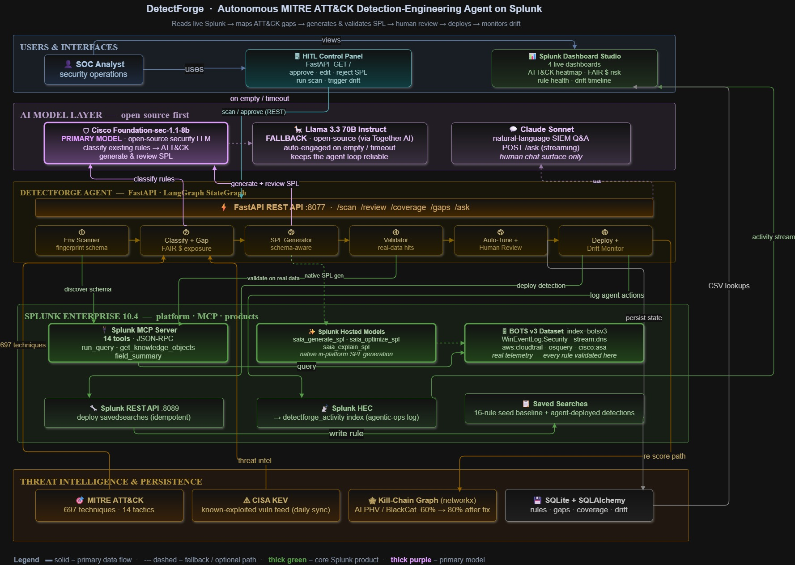

</details>

---

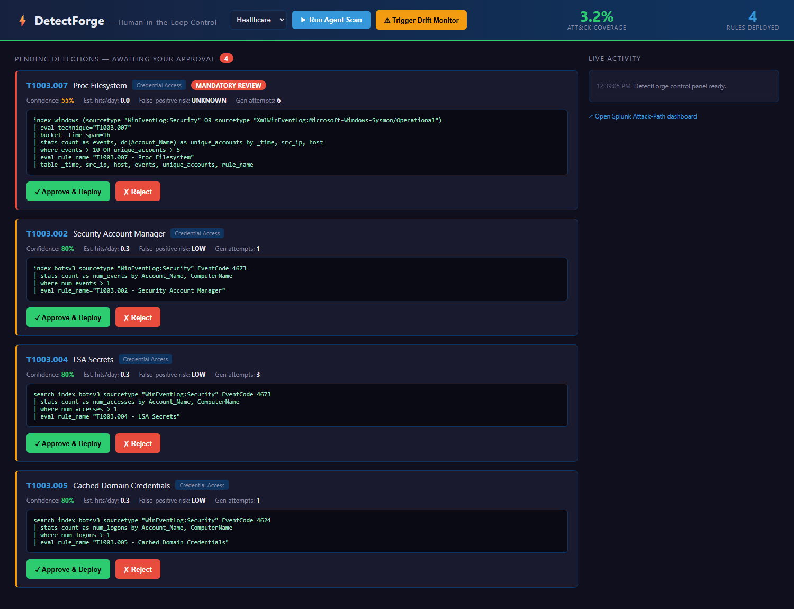

</div>

---

## The Problem

Enterprise SIEMs detect roughly **21% of known MITRE ATT&CK techniques**. The gap isn't laziness — it's the engineering bottleneck: writing, testing, and deploying detection rules is slow, manual, and requires scarce expertise. Meanwhile, threat actors like ALPHV/BlackCat (Change Healthcare, 2024) exploit exactly these blind spots.

## What DetectForge Does

DetectForge runs a **6-phase LangGraph agent pipeline** that turns your Splunk environment into its own input:

| Phase | Agent | What it does |
|-------|-------|-------------|
| ① | **Env Scanner** | Fingerprints indexes, sourcetypes, real EventCodes from live data |
| ② | **Rule Classifier + Gap Prioritizer** | Maps existing detections to ATT&CK, ranks gaps by FAIR financial exposure |
| ③ | **SPL Generator** | Generates environment-aware SPL using Llama-3.3-70B — one sourcetype, real EventCodes, no hallucinated fields |
| ④ | **Validator** | Runs every rule against live data; self-corrects 0-hit rules automatically |
| ⑤ | **Auto-Tuner + HITL** | Tunes noisy rules, queues all detections for human approval |
| ⑥ | **Deployer + Drift Monitor** | Deploys approved rules, monitors for schema drift every 6h |

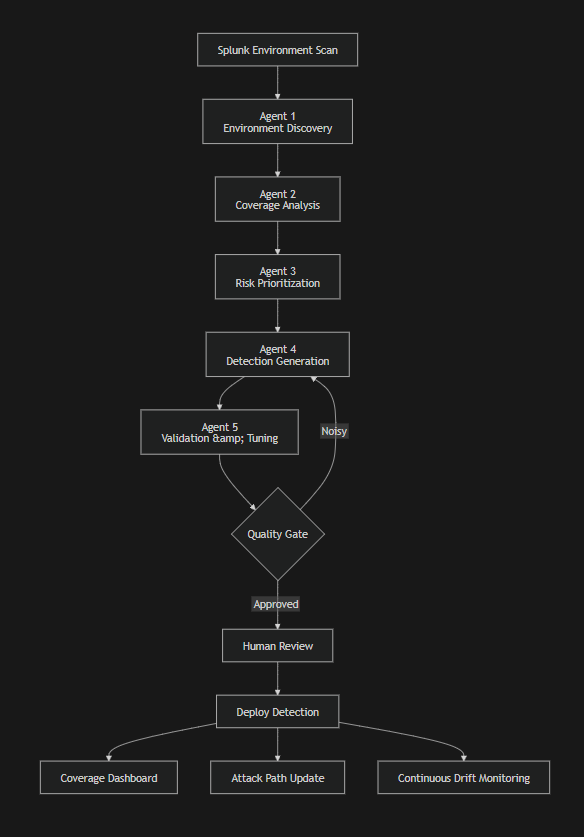

---

## Demo: The ALPHV / Change Healthcare Story

<div align="center">

[](https://youtu.be/RE-BmIuSu2o?si=dFKL0z3hvdyvcU0L)

[](https://youtu.be/RE-BmIuSu2o?si=dFKL0z3hvdyvcU0L)

</div>

DetectForge maps the real ALPHV/BlackCat kill chain (T1566 → T1078 → T1021 → T1003 → T1486) against your environment, shows you where the blind spots are, generates the missing detections, and lets an analyst approve them with one click.

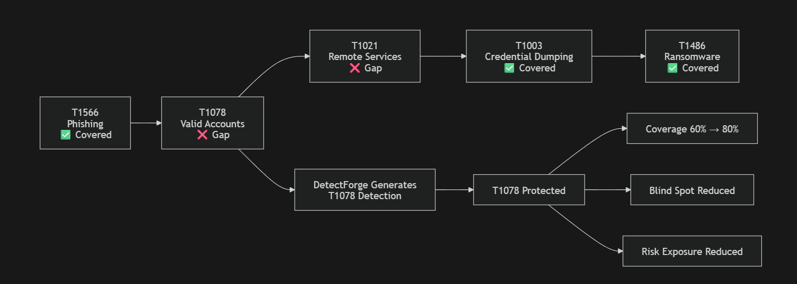

**Before:** 60% kill-chain coverage (T1078 Valid Accounts is a blind spot)  
**After:** 80% coverage — the agent generated a T1078 SPL rule, the analyst approved it, Splunk deployed it.

---

## Architecture

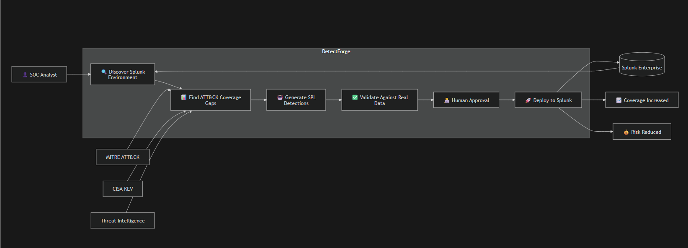

**Full technical architecture (Splunk integration · AI agents · data flow)** → [`ARCHITECTURE.md`](ARCHITECTURE.md)

### Tech Stack

| Layer | Technology |
|-------|-----------|
| Agent Orchestration | LangGraph StateGraph (6-phase pipeline) |
| API | FastAPI + uvicorn (:8077) |
| LLM — SPL Generation | Together AI · Llama-3.3-70B-Instruct-Turbo |
| LLM — SPL Review | Foundation-sec-1.1-8b (via Together AI) |
| LLM — NL Interface | Anthropic Claude claude-sonnet-4-6 (SSE streaming) |
| SIEM Integration | Splunk MCP Server (JSON-RPC 2.0, 14 tools) + REST API |
| Threat Intelligence | MITRE ATT&CK (697 techniques) · CISA KEV |
| Attack Graph | networkx DiGraph (actor kill-chain mapping) |
| Persistence | SQLite + SQLAlchemy ORM (8 tables) |
| Scheduling | APScheduler (drift monitor 6h, CISA KEV daily) |
| Dashboards | Splunk Dashboard Studio (4 dashboards, CSV-backed) |
| Container | Docker · `ankurshukla01/detectforge:latest` |

---

## Screenshots

<details>
<summary><strong>HITL Control Panel — approve, reject, or edit detections live</strong></summary>

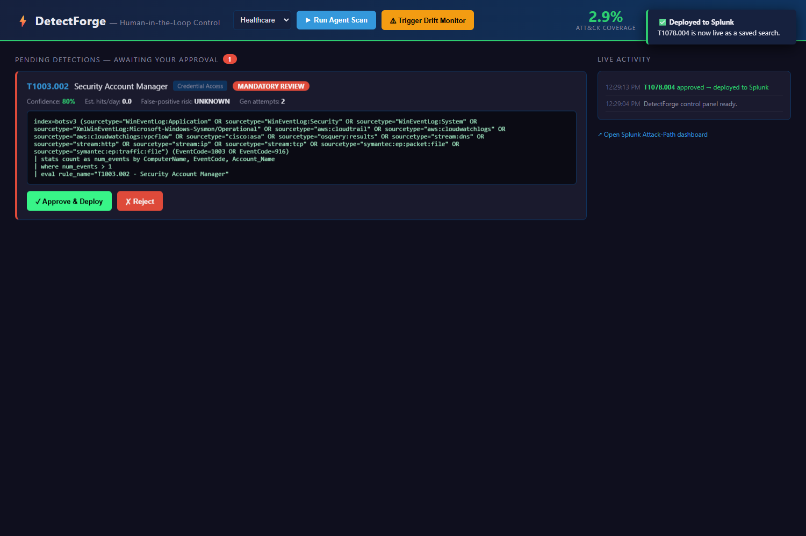

</details>

<details>
<summary><strong>ATT&CK Coverage Heatmap (Splunk Dashboard)</strong></summary>

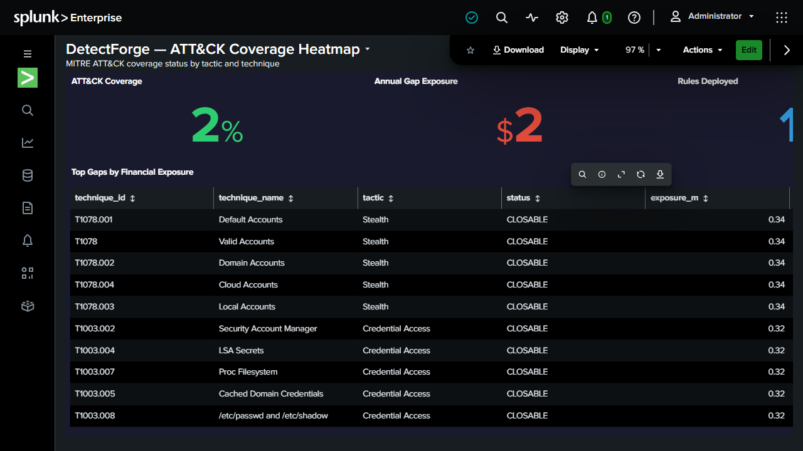

</details>

<details>
<summary><strong>Financial Risk Dashboard — FAIR model, gap exposure in $USD</strong></summary>

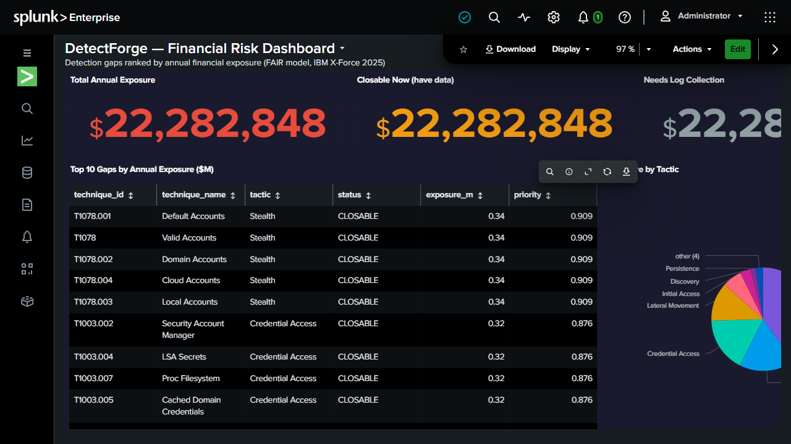

</details>

<details>
<summary><strong>Attack Path Visualizer — threat actor kill-chain coverage</strong></summary>

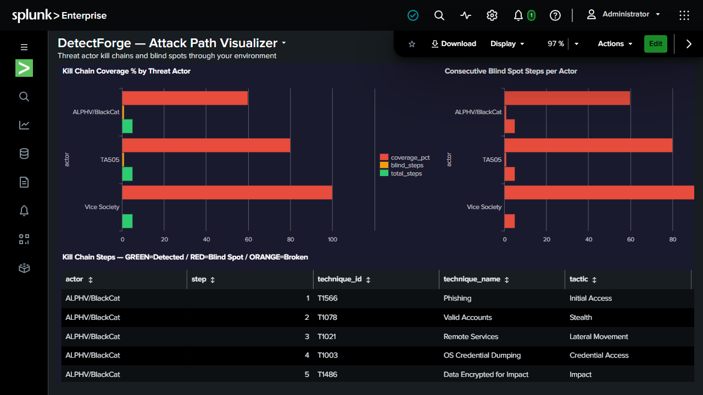

</details>

<details>
<summary><strong>Rule Health & Drift Monitor</strong></summary>

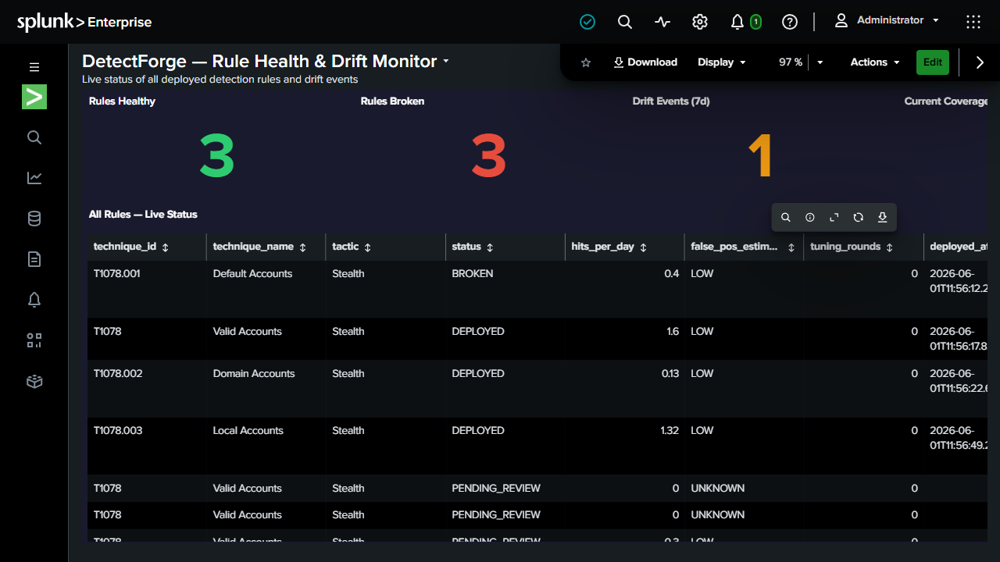

</details>

<details>
<summary><strong>Agent Activity (Live in Splunk)</strong></summary>

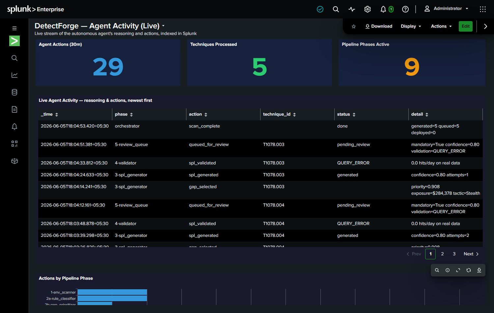

</details>

---

## Installation

### Prerequisites

- **Splunk Enterprise 10.x** with [Splunk MCP Server](https://splunk.com) installed
- A Together AI API key ([together.ai](https://together.ai)) — free tier works
- An Anthropic API key ([console.anthropic.com](https://console.anthropic.com)) — for the NL interface
- Git

---

### Option A — Docker (Recommended)

The fastest way to get running. The image is pre-built with all dependencies and the 47 MB ATT&CK JSON baked in — no network download on first start.

```bash
# 1. Pull the image
docker pull ankurshukla01/detectforge:latest

# 2. Clone the repo (for .env.example and docker-compose.yml)
git clone https://github.com/ankurshukla01/detectforge.git
cd detectforge

# 3. Create your config file
cp .env.example .env
```

Edit `.env` with your credentials (see [Configuration](#configuration) below), then:

```bash
# 4. Start
docker compose up

# Control panel:  http://localhost:8077/
# API docs:       http://localhost:8077/docs
# Health check:   http://localhost:8077/health
```

The SQLite database is persisted in the `detectforge_db` Docker volume — your data survives container restarts.

```bash
# Stop
docker compose down

# Stop and wipe database (fresh demo state)
docker compose down -v
```

> **Splunk is on the same machine?**  
> Add `extra_hosts: ["host.docker.internal:host-gateway"]` under the `detectforge` service in `docker-compose.yml`, then set `SPLUNK_URL=https://host.docker.internal:8089` and `MCP_ENDPOINT=http://host.docker.internal:8000/...` in `.env`.

---

### Option B — Local (uv)

For development or if you want to run against a local Splunk without Docker networking.

#### 1. Install uv

```bash
# macOS / Linux
curl -LsSf https://astral.sh/uv/install.sh | sh

# Windows (PowerShell)
powershell -ExecutionPolicy ByPass -c "irm https://astral.sh/uv/install.ps1 | iex"
```

#### 2. Clone and install

```bash
git clone https://github.com/ankurshukla01/detectforge.git
cd detectforge

# Install all dependencies from the lockfile (no venv activation needed)
uv sync
```

#### 3. Configure

```bash
cp .env.example .env
# Edit .env — see Configuration section below
```

#### 4. Seed the demo baseline (optional but recommended)

This installs 16 ATT&CK-annotated detection rules into Splunk to establish a realistic "before" state with deliberate gaps at T1078 and T1021:

```bash
uv run python scripts/seed_baseline.py

# To remove the baseline:
uv run python scripts/seed_baseline.py --remove
```

#### 5. Start the API

```bash
uv run uvicorn api.main:app --host 127.0.0.1 --port 8077
```

| URL | What it is |
|-----|-----------|
| `http://127.0.0.1:8077/` | HITL Control Panel |
| `http://127.0.0.1:8077/docs` | Interactive API docs |
| `http://127.0.0.1:8077/health` | Health check |

---

## Configuration

Copy `.env.example` to `.env` and fill in your values:

```ini
# ── Splunk ────────────────────────────────────────────────────────────────────
SPLUNK_URL=https://localhost:8089          # Splunk REST API endpoint
SPLUNK_USERNAME=admin
SPLUNK_PASSWORD=changeme
SPLUNK_VERIFY_SSL=false

# ── Splunk MCP Server ─────────────────────────────────────────────────────────
MCP_ENDPOINT=http://localhost:8000/en-US/splunkd/__raw/services/mcp
MCP_TOKEN=                                 # leave blank for Basic auth fallback

# ── Splunk HEC (agent activity logging) ───────────────────────────────────────
HEC_URL=https://localhost:8088
HEC_TOKEN=your-hec-token
HEC_INDEX=detectforge
HEC_ENABLED=true

# ── LLMs ─────────────────────────────────────────────────────────────────────
TOGETHER_API_KEY=your-together-key
TOGETHER_MODEL=meta-llama/Llama-3.3-70B-Instruct-Turbo

# ── Industry profile ──────────────────────────────────────────────────────────
INDUSTRY_PROFILE=healthcare               # healthcare | finance | energy | technology

# ── Database ──────────────────────────────────────────────────────────────────
DATABASE_URL=sqlite:///./detectforge.db   # Docker overrides this to /data/detectforge.db

# ── Tuning ────────────────────────────────────────────────────────────────────
MAX_SPL_GENERATION_ATTEMPTS=3
CONFIDENCE_MANDATORY_REVIEW_THRESHOLD=0.75
DRIFT_MONITOR_INTERVAL_HOURS=6
DRIFT_SILENT_CHECK_ENABLED=false          # disable for static datasets like BOTS v3
DRIFT_FRESHNESS_CHECK_ENABLED=false
```

---

## Running a Demo Scan

Once the API is running and Splunk is connected:

### 1. Seed the baseline (first time only)
```bash
uv run python scripts/seed_baseline.py
```

### 2. Open the HITL Control Panel
Navigate to `http://localhost:8077/` — you'll see live coverage stats and a **Run Agent Scan** button.

### 3. Run a scan
Click **Run Agent Scan** (or `POST /api/v1/scan`) — the 6-phase pipeline runs in the background (~2–4 min on BOTS v3).

### 4. Review and approve detections
Detection cards appear as the pipeline runs. Each shows the ATT&CK technique, generated SPL, confidence score, estimated hits/day, and FP risk. Click **Approve & Deploy** to push the rule to Splunk.

### 5. Watch the kill-chain update
After approving the T1078 rule, open the **Attack Path** dashboard in Splunk — the node flips from red (gap) to green (covered). Kill-chain coverage jumps from 60% → 80%.

### 6. Trigger drift detection
Click **Trigger Drift Monitor** to run a schema-drift check against all deployed rules. Any rule whose required fields no longer exist in the data is marked BROKEN.

---

## API Reference

| Method | Endpoint | Description |
|--------|----------|-------------|
| `POST` | `/api/v1/scan` | Trigger a full 6-phase scan |
| `GET` | `/api/v1/scan/{id}/status` | Poll scan progress |
| `GET` | `/api/v1/rules` | List all generated rules |
| `GET` | `/api/v1/coverage` | Current ATT&CK coverage % |
| `GET` | `/api/v1/coverage/history` | Coverage trend over time |
| `GET` | `/api/v1/review/queue` | Pending detections awaiting approval |
| `POST` | `/api/v1/review/{id}/approve` | Approve and deploy a detection |
| `POST` | `/api/v1/review/{id}/reject` | Reject a detection |
| `POST` | `/api/v1/review/{id}/edit` | Edit SPL and re-validate |
| `GET` | `/api/v1/gaps` | All ATT&CK coverage gaps |
| `GET` | `/api/v1/gaps/financial` | Gaps ranked by FAIR financial exposure |
| `POST` | `/api/v1/ask` | Natural language query (SSE streaming) |
| `GET` | `/api/v1/attack-path` | Threat actor kill-chain coverage JSON |
| `GET` | `/health` | Health check |

Full interactive docs at `http://localhost:8077/docs`.

---

## Project Structure

```
detectforge/
├── api/
│   ├── main.py               # FastAPI app, lifespan, CORS
│   ├── routers/              # One router per resource
│   └── static/
│       └── control.html      # HITL Control Panel (self-contained)
├── core/
│   ├── agent/
│   │   ├── orchestrator.py   # LangGraph StateGraph — 6-phase pipeline
│   │   ├── state.py          # DetectForgeState TypedDict
│   │   └── nodes/            # env_scanner, rule_classifier, gap_prioritizer,
│   │                         # spl_generator, validator, auto_tuner, deployer,
│   │                         # drift_monitor
│   ├── intelligence/
│   │   ├── attack_loader.py  # MITRE ATT&CK (697 techniques)
│   │   ├── kill_chain_mapper.py  # networkx actor kill-chains
│   │   └── threat_intel.py   # CISA KEV sync
│   ├── models/
│   │   ├── foundation_sec.py # Foundation-sec-1.1-8b SPL review
│   │   └── finetuned_spl.py  # Fine-tune hook (Together AI)
│   └── splunk/
│       ├── mcp_client.py     # JSON-RPC 2.0 MCP client
│       ├── rest_client.py    # Splunk REST API client
│       └── agent_logger.py   # HEC agent activity stream
├── db/
│   ├── models.py             # SQLAlchemy ORM (8 tables)
│   └── database.py           # Session factory, init_db
├── features/
│   ├── attack_path/          # networkx graph builder + API router
│   ├── coverage_timeline/    # Coverage trend tracker
│   ├── genealogy/            # Rule lineage (parent_rule_id chain)
│   └── nl_interface/         # Claude claude-sonnet-4-6 streaming NL query
├── dashboard/
│   └── setup_dashboards.py   # Push results to Splunk CSV lookups
├── scheduler/
│   └── scheduler.py          # APScheduler — drift monitor + KEV sync
├── scripts/
│   ├── seed_baseline.py      # Install 16 demo detections into Splunk
│   └── prepare_finetune_data.py  # Export training data for fine-tuning
├── knowledge/
│   ├── attack/
│   │   └── enterprise-attack.json  # MITRE ATT&CK (baked into Docker image)
│   ├── profiles/             # Industry risk profiles (healthcare, finance…)
│   └── spl_seeds/            # Tactic-level seed SPL templates
├── docs/
│   ├── architecture.md       # Full technical architecture (Mermaid diagrams)
│   ├── architecture/         # Architecture diagrams (PNG)
│   └── screenshots/          # App screenshots
├── ARCHITECTURE.md           # Architecture diagram (Splunk · AI · data flow) — submission requirement
├── architecture_diagram.png # Architecture overview PNG — submission requirement
├── Dockerfile                # Multi-stage build (builder + runtime)
├── docker-compose.yml        # Single-command startup
├── .env.example              # Config template
└── pyproject.toml            # Dependencies (managed by uv)
```

---

## Splunk Dashboard Setup

After running a scan, push results to Splunk's Dashboard Studio:

```bash
# Automatic — called at the end of every scan
# Manual trigger:
uv run python dashboard/setup_dashboards.py
```

Import the 4 dashboard JSONs from `dashboard/` into Splunk Dashboard Studio:
- **Coverage Heatmap** — ATT&CK matrix with coverage % per technique
- **Financial Risk** — FAIR model exposure by technique ($USD)
- **Rule Health & Drift** — deployed rules, BROKEN alerts, drift events
- **Attack Path Visualizer** — threat actor kill-chains with blind-spot counts

---

## Splunk Integration — Source Reference

Every Splunk product touchpoint in the codebase, with direct links to the relevant lines.

> All links are pinned to commit [`e370993`](https://github.com/AnkurKumarShukla/DetectForge/commit/e37099369a2b840f9e9a60db0e4c68d7be1ab874).

---

### Splunk MCP Server (JSON-RPC 2.0)

The entire agent pipeline communicates with Splunk through the MCP Server over JSON-RPC 2.0. All 14 exposed tools are called through a single transport layer.

| What | File | Lines |
|------|------|-------|
| JSON-RPC 2.0 `tools/call` transport — every MCP call goes through here | [`core/splunk/mcp_client.py`](https://github.com/AnkurKumarShukla/DetectForge/blob/e37099369a2b840f9e9a60db0e4c68d7be1ab874/core/splunk/mcp_client.py#L56-L83) | L56–83 |
| `tools/list` — enumerate all available MCP tools on startup | [`core/splunk/mcp_client.py`](https://github.com/AnkurKumarShukla/DetectForge/blob/e37099369a2b840f9e9a60db0e4c68d7be1ab874/core/splunk/mcp_client.py#L88-L97) | L88–97 |
| `splunk_run_query` — execute SPL and return structured results | [`core/splunk/mcp_client.py`](https://github.com/AnkurKumarShukla/DetectForge/blob/e37099369a2b840f9e9a60db0e4c68d7be1ab874/core/splunk/mcp_client.py#L101-L125) | L101–125 |
| `splunk_get_indexes` — index metadata for environment fingerprinting | [`core/splunk/mcp_client.py`](https://github.com/AnkurKumarShukla/DetectForge/blob/e37099369a2b840f9e9a60db0e4c68d7be1ab874/core/splunk/mcp_client.py#L127-L138) | L127–138 |
| `splunk_get_knowledge_objects` — discover all saved searches (`row_limit=1000`) | [`core/splunk/mcp_client.py`](https://github.com/AnkurKumarShukla/DetectForge/blob/e37099369a2b840f9e9a60db0e4c68d7be1ab874/core/splunk/mcp_client.py#L144-L163) | L144–163 |
| `saia_generate_spl` / `saia_optimize_spl` / `saia_explain_spl` / `saia_ask_splunk_question` wrappers — Splunk AI Assistant hosted-model tools (currently routing to Llama-3.3-70B via Together AI pending `saia_*` config) | [`core/splunk/mcp_client.py`](https://github.com/AnkurKumarShukla/DetectForge/blob/e37099369a2b840f9e9a60db0e4c68d7be1ab874/core/splunk/mcp_client.py#L164-L192) | L164–192 |

---

### Splunk REST API (`:8089`)

Used for deploying approved detection rules as saved searches and managing dashboard views.

| What | Endpoint | File | Lines |
|------|----------|------|-------|
| Create saved search — deploys a new detection rule | `POST /servicesNS/nobody/{app}/saved/searches` | [`core/splunk/rest_client.py`](https://github.com/AnkurKumarShukla/DetectForge/blob/e37099369a2b840f9e9a60db0e4c68d7be1ab874/core/splunk/rest_client.py#L66-L112) | L66–112 |
| Update saved search — idempotent redeploy on 409 Conflict | `POST /servicesNS/nobody/{app}/saved/searches/{name}` | [`core/splunk/rest_client.py`](https://github.com/AnkurKumarShukla/DetectForge/blob/e37099369a2b840f9e9a60db0e4c68d7be1ab874/core/splunk/rest_client.py#L114-L122) | L114–122 |
| Delete saved search | `DELETE /servicesNS/nobody/{app}/saved/searches/{name}` | [`core/splunk/rest_client.py`](https://github.com/AnkurKumarShukla/DetectForge/blob/e37099369a2b840f9e9a60db0e4c68d7be1ab874/core/splunk/rest_client.py#L119-L132) | L119–132 |
| List / get saved searches | `GET /servicesNS/nobody/{app}/saved/searches` | [`core/splunk/rest_client.py`](https://github.com/AnkurKumarShukla/DetectForge/blob/e37099369a2b840f9e9a60db0e4c68d7be1ab874/core/splunk/rest_client.py#L134-L144) | L134–144 |
| Connectivity health check | `GET /services/server/info` | [`core/splunk/rest_client.py`](https://github.com/AnkurKumarShukla/DetectForge/blob/e37099369a2b840f9e9a60db0e4c68d7be1ab874/core/splunk/rest_client.py#L139-L144) | L139–144 |
| Install dashboards via Dashboard Studio REST | `POST /servicesNS/nobody/{app}/data/ui/views` | [`dashboard/setup_dashboards.py`](https://github.com/AnkurKumarShukla/DetectForge/blob/e37099369a2b840f9e9a60db0e4c68d7be1ab874/dashboard/setup_dashboards.py#L53-L85) | L53–85 |
| Run inline search job to materialise CSV lookups | `POST /servicesNS/nobody/{app}/search/jobs` | [`dashboard/setup_dashboards.py`](https://github.com/AnkurKumarShukla/DetectForge/blob/e37099369a2b840f9e9a60db0e4c68d7be1ab874/dashboard/setup_dashboards.py#L100-L140) | L100–140 |
| Set lookup table ACL to global (required for Dashboard Studio) | `POST /servicesNS/nobody/{app}/data/lookup-table-files/{name}/acl` | [`dashboard/setup_dashboards.py`](https://github.com/AnkurKumarShukla/DetectForge/blob/e37099369a2b840f9e9a60db0e4c68d7be1ab874/dashboard/setup_dashboards.py#L143-L149) | L143–149 |

---

### Splunk HEC — Agent Activity Logger

Every agent action (scan start, SPL generated, rule queued, drift detected, etc.) is streamed to a `detectforge_activity` index via HEC. This powers the live "Agentic Ops" view inside Splunk.

| What | File | Lines |
|------|------|-------|
| `AgentActivityLogger` class — fire-and-forget, fail-safe HEC emitter | [`core/splunk/agent_logger.py`](https://github.com/AnkurKumarShukla/DetectForge/blob/e37099369a2b840f9e9a60db0e4c68d7be1ab874/core/splunk/agent_logger.py#L25-L99) | L25–99 |
| `/services/collector/event` endpoint wired on init | [`core/splunk/agent_logger.py`](https://github.com/AnkurKumarShukla/DetectForge/blob/e37099369a2b840f9e9a60db0e4c68d7be1ab874/core/splunk/agent_logger.py#L31) | L31 |

---

### SPL (Search Processing Language)

SPL is used in four distinct ways: generation, validation, environment fingerprinting, and drift detection.

| What | File | Lines |
|------|------|-------|
| SPL generation prompt — enforces 1 sourcetype, 1 EventCode, no rare literals, no agg funcs in `where` | [`core/agent/nodes/spl_generator.py`](https://github.com/AnkurKumarShukla/DetectForge/blob/e37099369a2b840f9e9a60db0e4c68d7be1ab874/core/agent/nodes/spl_generator.py#L14-L32) | L14–32 |
| `_pick_primary_sourcetype()` — maps ATT&CK tactic → most relevant Splunk sourcetype | [`core/agent/nodes/spl_generator.py`](https://github.com/AnkurKumarShukla/DetectForge/blob/e37099369a2b840f9e9a60db0e4c68d7be1ab874/core/agent/nodes/spl_generator.py#L91-L110) | L91–110 |
| `_top_eventcodes()` — live SPL query: `top limit=12 EventCode` from real BOTS v3 data (prevents hallucinated EventCodes) | [`core/agent/nodes/spl_generator.py`](https://github.com/AnkurKumarShukla/DetectForge/blob/e37099369a2b840f9e9a60db0e4c68d7be1ab874/core/agent/nodes/spl_generator.py#L113-L128) | L113–128 |
| `validate_spl()` — runs generated SPL against live data, classifies `GOOD` / `DATA_ABSENT` / `QUERY_ERROR` / `NOISY` / `VERY_NOISY` | [`core/agent/nodes/validator.py`](https://github.com/AnkurKumarShukla/DetectForge/blob/e37099369a2b840f9e9a60db0e4c68d7be1ab874/core/agent/nodes/validator.py#L10-L85) | L10–85 |
| `makeresults format=csv data=... \| outputlookup` — CSV lookup bridge for Dashboard Studio (workaround for KV Store `inputlookup` returning 0 rows on single-instance Splunk) | [`dashboard/setup_dashboards.py`](https://github.com/AnkurKumarShukla/DetectForge/blob/e37099369a2b840f9e9a60db0e4c68d7be1ab874/dashboard/setup_dashboards.py#L101-L130) | L101–130 |
| `SCHEMA_DRIFT` field-existence check — `{field}=* \| stats count` with `earliest=0`, reads `results[0]['count']` value (not the stats object) | [`core/agent/nodes/drift_monitor.py`](https://github.com/AnkurKumarShukla/DetectForge/blob/e37099369a2b840f9e9a60db0e4c68d7be1ab874/core/agent/nodes/drift_monitor.py#L68-L95) | L68–95 |

---

### Deployer — Rule Deployment to Splunk

| What | File | Lines |
|------|------|-------|
| `deploy_rule()` — calls `saia_explain_spl`, then `create_saved_search` (or `update_saved_search` on 409); marks rule `DEPLOYED` and updates attack-path coverage | [`core/agent/nodes/deployer.py`](https://github.com/AnkurKumarShukla/DetectForge/blob/e37099369a2b840f9e9a60db0e4c68d7be1ab874/core/agent/nodes/deployer.py#L17-L55) | L17–55 |

---

### Env Scanner — Splunk Environment Fingerprinting

| What | File | Lines |
|------|------|-------|
| `run_env_scanner()` — calls `get_indexes()` + `discover_knowledge_objects()`, queries `fieldsummary` per security-relevant sourcetype, persists `EnvSnapshot` | [`core/agent/nodes/env_scanner.py`](https://github.com/AnkurKumarShukla/DetectForge/blob/e37099369a2b840f9e9a60db0e4c68d7be1ab874/core/agent/nodes/env_scanner.py#L30-L95) | L30–95 |

---

### Drift Monitor — APScheduler + Splunk

| What | File | Lines |
|------|------|-------|
| `run_drift_monitor()` — runs on every deployed rule every 6 h; marks rules `BROKEN` on `SCHEMA_DRIFT` | [`core/agent/nodes/drift_monitor.py`](https://github.com/AnkurKumarShukla/DetectForge/blob/e37099369a2b840f9e9a60db0e4c68d7be1ab874/core/agent/nodes/drift_monitor.py#L149-L200) | L149+ |
| APScheduler wiring — drift monitor every 6 h, CISA KEV sync daily | [`scheduler/scheduler.py`](https://github.com/AnkurKumarShukla/DetectForge/blob/e37099369a2b840f9e9a60db0e4c68d7be1ab874/scheduler/scheduler.py) | full file |

---

### Threat Actor Kill-Chain Mapping

| What | File | Lines |
|------|------|-------|
| `THREAT_ACTOR_CHAINS` — healthcare / finance / energy / technology actor chains (ALPHV, FIN7, Vice Society, Lazarus, etc.) | [`core/intelligence/kill_chain_mapper.py`](https://github.com/AnkurKumarShukla/DetectForge/blob/e37099369a2b840f9e9a60db0e4c68d7be1ab874/core/intelligence/kill_chain_mapper.py#L4-L25) | L4–25 |
| `score_actor_chain()` — computes coverage %, blind-window, and minimum fix technique for a given actor | [`core/intelligence/kill_chain_mapper.py`](https://github.com/AnkurKumarShukla/DetectForge/blob/e37099369a2b840f9e9a60db0e4c68d7be1ab874/core/intelligence/kill_chain_mapper.py#L64-L132) | L64–132 |

---

## License

[MIT](LICENSE) — © 2026 Ankur Shukla
