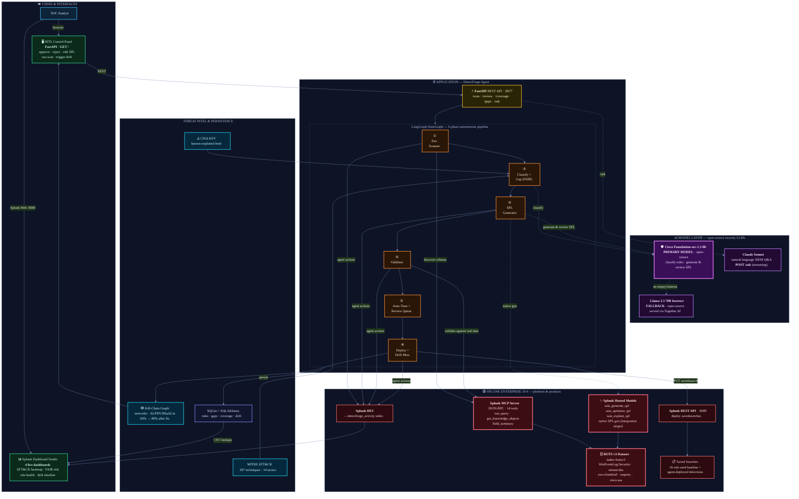

# DetectForge — Architecture Diagram

> **Splunk Agentic Ops Hackathon 2026 · Security Track**
> Autonomous MITRE ATT&CK detection-engineering agent built **on top of Splunk**.
> It reads live Splunk telemetry, finds coverage gaps, generates environment-aware
> SPL with open-source security LLMs, validates against real data, routes through a
> human-in-the-loop, deploys to Splunk, and continuously monitors for drift.

---

## 1 · System Architecture

---

## 2 · How Splunk Products & AI Models Power the Solution

| Component | Product / Model | Role in DetectForge |
|-----------|-----------------|---------------------|
| **Splunk MCP Server** | Splunk Enterprise 10.4 (14 MCP tools) | The agent's hands inside Splunk — schema discovery (`get_knowledge_objects`, `field_summary`) and live validation (`run_query`) against real data. |
| **Splunk Hosted Models** | `saia_generate_spl` · `saia_optimize_spl` · `saia_explain_spl` | Native Splunk SPL generation/optimization path — wired as a first-class generator and tuner (integration target for *Best Use of Splunk Hosted Models*). |
| **BOTS v3 Dataset** | `index=botsv3` | Real enterprise telemetry (WinEventLog:Security, stream:dns, aws:cloudtrail, osquery, cisco:asa) every detection is generated *and validated* against — no synthetic data. |
| **Splunk REST API** | `:8089 /savedsearches` | Idempotent deployment of approved detections back into Splunk as saved searches. |
| **Splunk HEC** | `detectforge_activity` index | Streams every agent action back into Splunk → an "agentic ops" activity dashboard. |
| **Splunk Dashboard Studio** | 4 dashboards | ATT&CK coverage heatmap, FAIR financial-risk, rule health, drift timeline — fed via CSV lookups. |
| **🛡️ Cisco Foundation-sec-1.1-8b** | **Primary LLM** (open-source) | Purpose-built security model: classifies existing rules to ATT&CK and generates/reviews SPL. |
| **🦙 Llama 3.3 70B Instruct** | **Fallback LLM** (open-source, via Together AI) | Resilience path — takes over instantly if the primary returns empty/times out, keeping generation reliable. |
| **💬 Claude Sonnet** | NL interface | Conversational SIEM Q&A at `POST /ask` (streaming) over live coverage state. |

---

## 3 · End-to-End Data Flow

---

## 4 · Model Strategy — Why This Mix

- **Primary: Cisco Foundation-sec-1.1-8b** — an open-source LLM *purpose-built for security*, used for ATT&CK rule classification and SPL generation/review. Domain-specific accuracy without sending data to a closed vendor.
- **Fallback: Llama 3.3 70B Instruct (Together AI)** — also fully open-source. Engaged automatically when the primary returns empty content or times out, so the autonomous loop never stalls.
- **Splunk Hosted Models (`saia_*`)** — native in-platform SPL generation/optimization, wired as a first-class path to showcase Splunk's own AI Assistant for SPL.
- **Claude Sonnet** — only for the human-facing natural-language Q&A surface, not in the autonomous generation loop.

*Open-source-first design: the entire detection-engineering loop runs on open models; closed models are confined to the optional human chat interface.*
